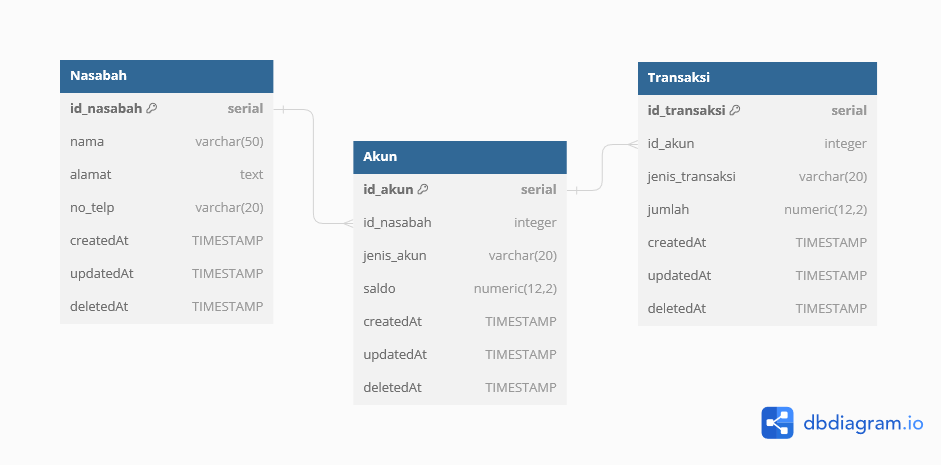

# Binar-Challenge-3-Database
Challenge Chapter 3 - RDBMS (Relational Database Management System) - Bootcamp Backend Binar Academy

## Delivery
- Analisa struktur data pada challenge 2
- Rancang Entity Relationship Diagram (ERD) sederhana yang mencakup tabel-tabel yang diperlukan
- Buat file SQL dengan nama create_and_insert.sql
- Tulis perintah SQL untuk membuat tabel-tabel sesuai dengan ERD yang Anda rancang
- Isi file SQL dengan perintah SQL untuk mengisi beberapa data awal ke dalam tabel-tabel

## Criteria
- Mampu merancang dan membuat ERD (40 points)
- Membuat Database & tabel menggunakan DDL (30 points)
- Melakukan operasi CRUD dengan DML (30 points)


## Identifikasi Entitas yang Terlibat:
- Nasabah
- Akun
- Transaksi

## Atribut-atribut yang Relevan:
- Nasabah:
  - id_nasabah (Primary Key)
  - nama
  - alamat
  - no_telp

- Akun:
  - id_akun (Primary Key)
  - id_nasabah (Foreign Key ke id_nasabah di tabel Nasabah)
  - jenis_akun (contoh: tabungan.)
  - saldo

- Transaksi:
  - id_transaksi (Primary Key)
  - id_akun (Foreign Key ke id_akun di tabel Akun)
  - jenis_transaksi (contoh: penyetoran,  transfer.)
  - jumlah
  - tanggal

## Relasi Antar Entitas:
- Setiap Nasabah dapat memiliki beberapa Akun (One-to-Many antara Nasabah dan Akun)
- Setiap Akun hanya dimiliki oleh satu Nasabah (Many-to-One antara Akun dan Nasabah)
- Satu Akun dapat memiliki banyak Transaksi (One-to-Many antara Akun dan Transaksi)
- Setiap Transaksi hanya terkait dengan satu Akun (Many-to-One antara Transaksi dan Akun)

## ERD (Entity-Relationship Diagram):


## Buatkan SQL untuk mendefinisikan table
```bash
# membuat database
CREATE DATABASE create_and_insert;

# membuat table Nasabah
CREATE TABLE Nasabah (
    id_nasabah SERIAL PRIMARY KEY,
    nama VARCHAR(255) NOT NULL,
    alamat TEXT NOT NULL,
    no_telp VARCHAR(20) NOT NULL,
    createdAt TIMESTAMP NOT NULL DEFAULT NOW(),
    updatedAt TIMESTAMP DEFAULT NOW(),
    deletedAt TIMESTAMP
);

# membuat table Akun dan foreign key ke id_nasabah
CREATE TABLE Akun (
    id_akun SERIAL PRIMARY KEY,
    id_nasabah INT REFERENCES Nasabah(id_nasabah) ON DELETE CASCADE,
    jenis_akun VARCHAR(50) NOT NULL,
    saldo NUMERIC(12, 2) DEFAULT 0.00,
    createdAt TIMESTAMP NOT NULL DEFAULT NOW(),
    updatedAt TIMESTAMP DEFAULT NOW(),
    deletedAt TIMESTAMP
);

# membuat table Transaksi dan foreign key ke id_akun
CREATE TABLE Transaksi (
    id_transaksi SERIAL PRIMARY KEY,
    id_akun INT REFERENCES Akun(id_akun) ON DELETE CASCADE,
    jenis_transaksi VARCHAR(50) NOT NULL,
    jumlah NUMERIC(12, 2) NOT NULL,
    createdAt TIMESTAMP NOT NULL DEFAULT NOW(),
    updatedAt TIMESTAMP DEFAULT NOW(),
    deletedAt TIMESTAMP
);
```

## Buatkan SQL untuk operasi CRUD pada table yang ada
### INSERT
```bash
# insert into table Nasabah
INSERT INTO Nasabah (nama, alamat, no_telp) VALUES 
('Wahyu P', 'Dusun 3, Jati Agung', '123-456-7890'),
('Pambudi', 'Bali Kutai', '234-567-8901');

# insert into table Akun
INSERT INTO Akun (id_nasabah, jenis_akun, saldo) VALUES 
(1, 'Tabungan', 1000),
(1, 'Deposito', 5000),
(2, 'Tabungan', 2000);

# insert into table Transaksi
INSERT INTO Transaksi (id_akun, jenis_transaksi, jumlah) VALUES 
(1, 'Penyetoran', 500),
(1, 'Penarikan', 200),
(2, 'Transfer Masuk', 1000),
(3, 'Penyetoran', 300);
```

### UPDATE
```bash
# update nasabah
UPDATE Nasabah 
SET nama = 'Wahyu P Updated', updatedAt = CURRENT_TIMESTAMP
WHERE id_nasabah = 1;

# update akun
UPDATE Akun
SET jenis_akun = 'Investasi', updatedAt = CURRENT_TIMESTAMP
WHERE id_akun = 2;

# update transaksi
UPDATE Transaksi
SET jenis_transaksi = 'Transfer Keluar', jumlah = 1500, updatedAt = CURRENT_TIMESTAMP
WHERE id_transaksi = 2;
```

### DELETE
```bash
# delete nasabah
DELETE FROM Nasabah WHERE id_nasabah = 1;

# delete akun
DELETE FROM Akun WHERE id_nasabah = 3;

# delete transaksi
DELETE FROM Transaksi WHERE id_akun = 1;
```
