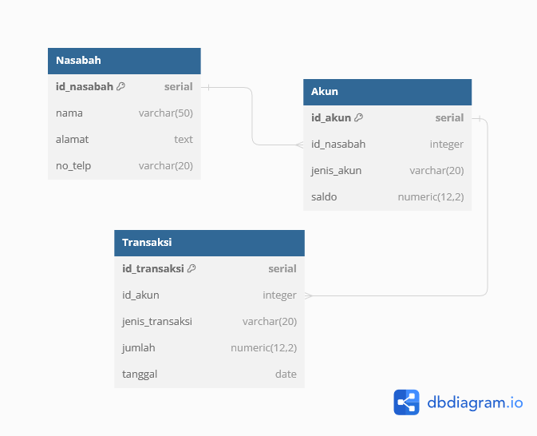

# Binar-Challenge-3-Database
Challenge Chapter 3 - RDBMS (Relational Database Management System) - Bootcamp Backend Binar Academy

## Delivery
- Analisa struktur data pada challenge 2
- Rancang Entity Relationship Diagram (ERD) sederhana yang mencakup tabel-tabel yang diperlukan
- Buat file SQL dengan nama create_and_insert.sql
- Tulis perintah SQL untuk membuat tabel-tabel sesuai dengan ERD yang Anda rancang
- Isi file SQL dengan perintah SQL untuk mengisi beberapa data awal ke dalam tabel-tabel

## Criteria
- Mampu merancang dan membuat ERD (40 points)
- Membuat Database & tabel menggunakan DDL (30 points)
- Melakukan operasi CRUD dengan DML (30 points)

## Identifikasi Entitas yang Terlibat:
- Nasabah
- Akun
- Transaksi

## Atribut-atribut yang Relevan:
- Nasabah:
  - id_nasabah (Primary Key)
  - nama
  - alamat
  - no_telp

- Akun:
  - id_akun (Primary Key)
  - id_nasabah (Foreign Key mengacu ke id_nasabah di tabel Nasabah)
  - jenis_akun (contoh: tabungan, deposito, dll.)
  - saldo

- Transaksi:
  - id_transaksi (Primary Key)
  - id_akun (Foreign Key mengacu ke id_akun di tabel Akun)
  - jenis_transaksi (contoh: penyetoran, penarikan, transfer, dll.)
  - jumlah
  - tanggal

## Relasi Antar Entitas:
- Setiap Nasabah dapat memiliki beberapa Akun (One-to-Many antara Nasabah dan Akun)
- Setiap Akun hanya dimiliki oleh satu Nasabah (Many-to-One antara Akun dan Nasabah)
- Satu Akun dapat memiliki banyak Transaksi (One-to-Many antara Akun dan Transaksi)
- Setiap Transaksi hanya terkait dengan satu Akun (Many-to-One antara Transaksi dan Akun)

## ERD (Entity-Relationship Diagram):

